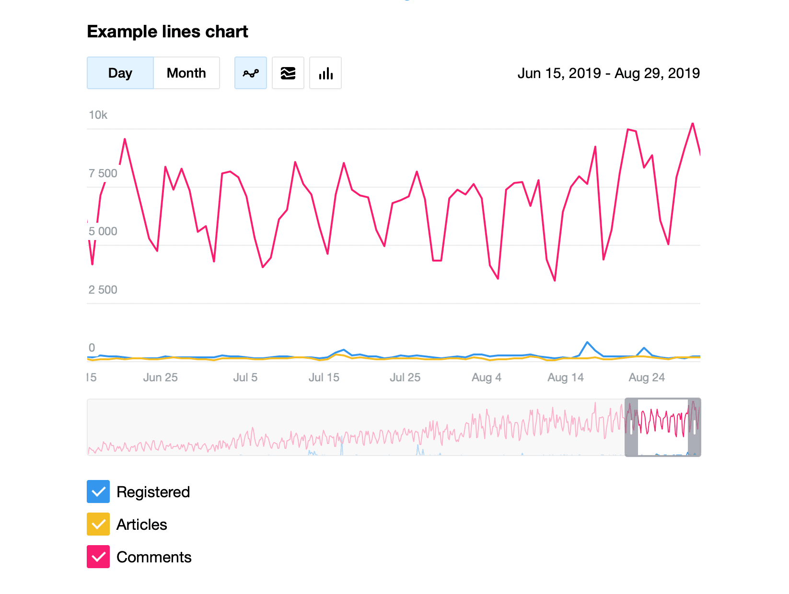
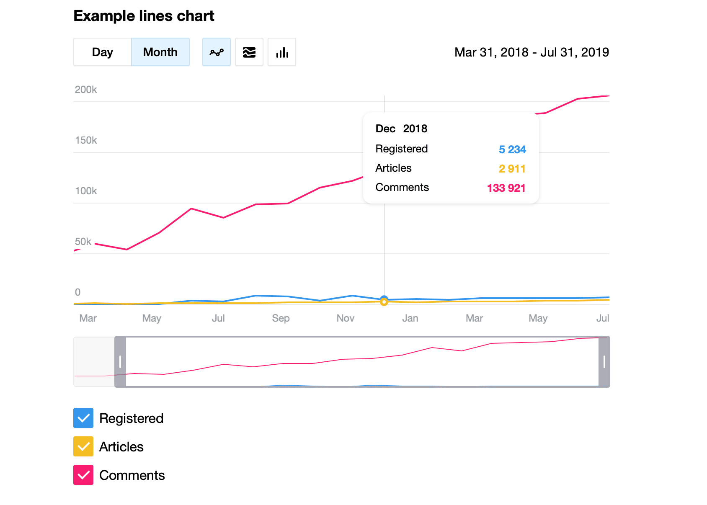
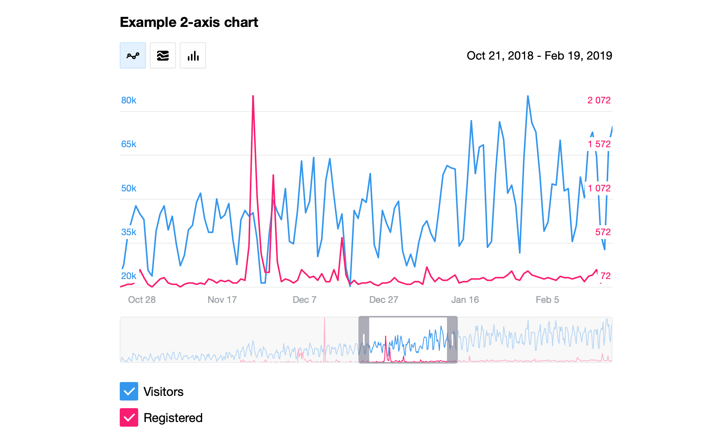
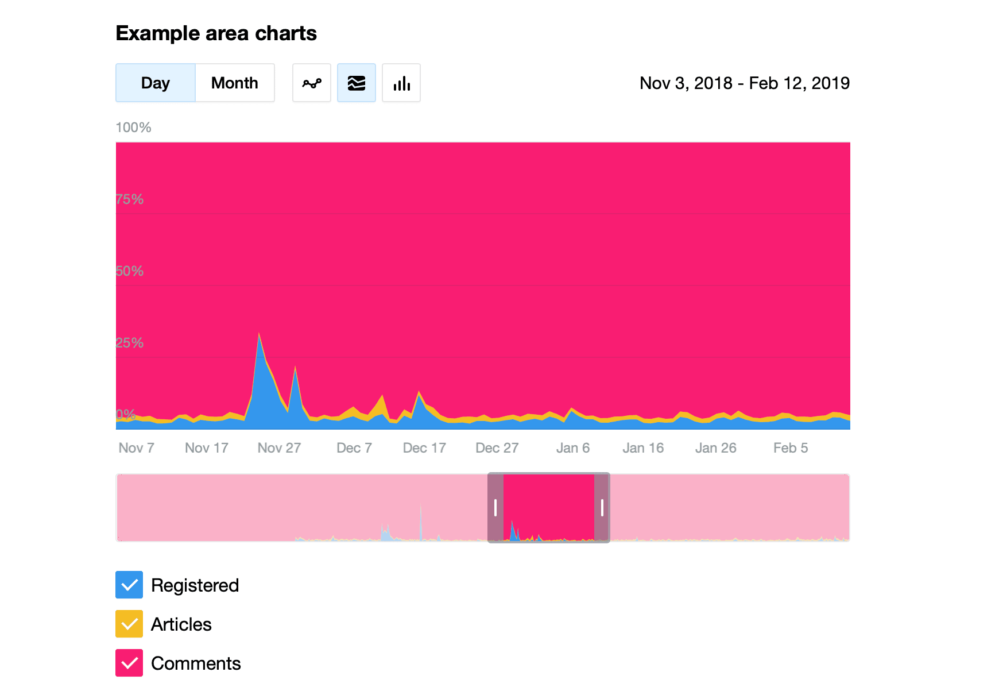
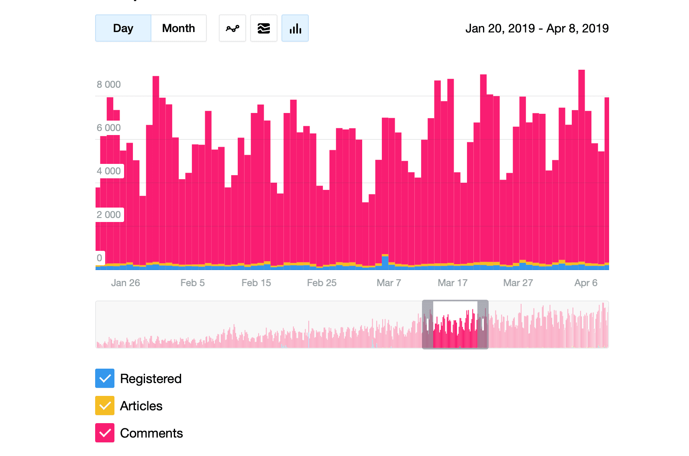
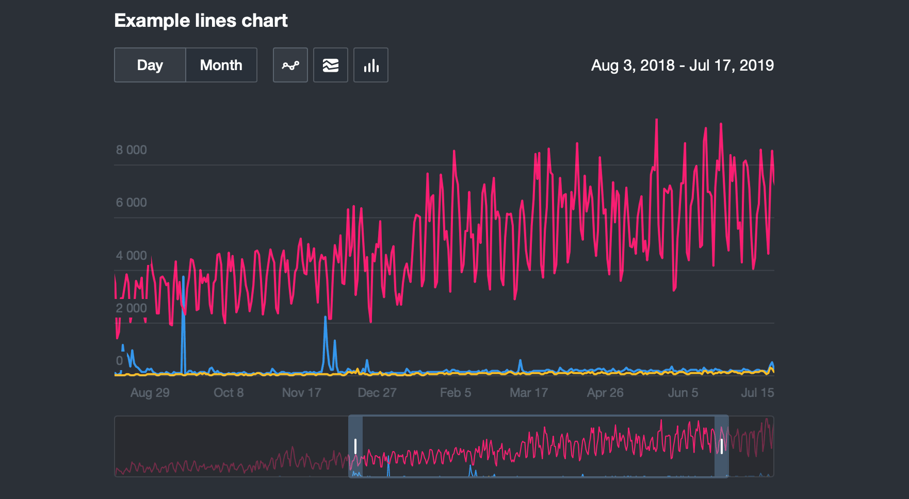

# Graphon

Engine for rendering charts on native JS.

Features 

- Line charts
- Area charts
- Bar charts
- 2 OY axis chart
- Minimap dragging
- Scaling
- Scrolling
- Night Theme













# Install

```
yarn add graphon
```

# Input data format

day 1 | chart 1 | ... | chart N

day 2 | chart 1 | ... | chart N

day ... | chart 1 | ... | chart N

day N | chart 1 | ... | chart N

```
2019-08-14,282,174,7972
2019-08-15,853,184,7649
2019-08-16,504,209,9261
2019-08-17,227,130,4401
2019-08-18,259,129,5687
2019-08-19,248,175,8109
2019-08-20,245,220,9992
2019-08-21,246,258,9942
2019-08-22,635,240,8374
2019-08-23,268,199,8880
2019-08-24,224,180,6091
2019-08-25,175,129,5059
2019-08-26,222,186,7928
2019-08-27,182,205,9172
2019-08-28,246,214,10293
2019-08-29,250,207,8912
```


# Author

Peter Savchenko

CodeX
https://codex.so
